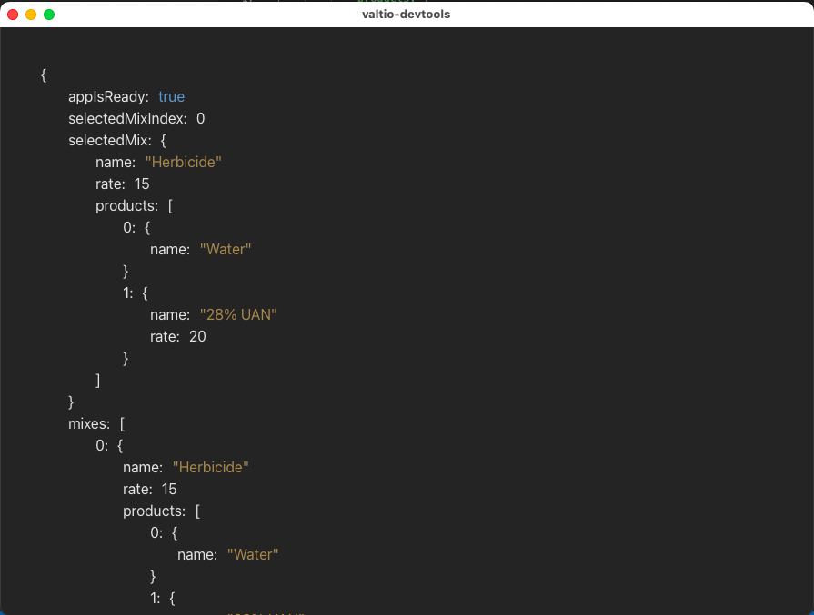

## valtio-devtools-client

The client library for use with with [valtio-devtools](https://www.npmjs.com/package/valtio-devtools). Works with [Expo](https://expo.dev/).

### Usage
---

    import { proxy } from  'valtio'
    import devtools from 'valtio-devtools-client'

	const  state = proxy({
		 foo: true,
		 bar: false
	})
	const devtoolOptions = {
		host: 'localhost' //default
		
		//Configure host automatically with `babel-plugin-ip-address`
		remote: false //default
	}
    devtools(state, options)

### Options
---
`host`: `"localhost"` //default
Host address where `valtio-devtools` application is running.
			
`remote`: `false` //default
Have babel configure host address automatically with [babel-plugin-ip-address](npm%20i%20https://github.com/AndreyKozlov1984/babel-plugin-ip-address). Useful when testing Expo apps on device.
 - `npm i https://github.com/AndreyKozlov1984/babel-plugin-ip-address` 
 -  add `babel-plugin-ip-address` to `plugins` in `babel.config.js`.

